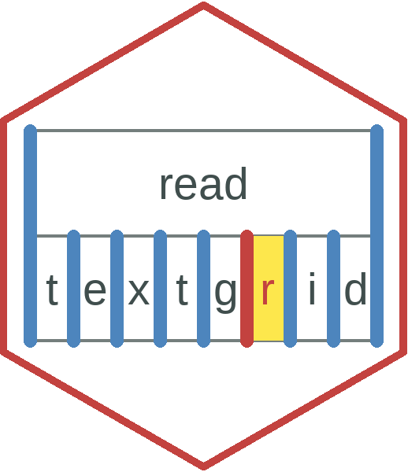

<!-- README.md is generated from README.Rmd. Please edit that file -->

# readtextgrid 

<!-- badges: start -->

[](https://travis-ci.org/tjmahr/readtextgrid)
<!-- badges: end -->

The goal of readtextgrid is to provide a textgrid parser for R.

## Installation

You can install the GitHub version of readtextgrid with:

``` r
remotes::install_github("tjmahr/readtextgrid")
```

## Example

This is a basic example which shows you how to solve a common problem:

``` r
library(readtextgrid)

# This textgrid as an empty PointTier
tg <- system.file("Mary_John_bell.TextGrid", package = "readtextgrid")
read_textgrid(tg)
#> # A tibble: 3 x 10
#>   file  tier_num tier_name tier_type tier_xmin tier_xmax  xmin  xmax text 
#>   <chr>    <dbl> <chr>     <chr>         <dbl>     <dbl> <dbl> <dbl> <chr>
#> 1 Mary~        1 Mary      Interval~         0         1     0     1 ""   
#> 2 Mary~        2 John      Interval~         0         1     0     1 ""   
#> 3 Mary~        3 bell      TextTier          0         1    NA    NA <NA> 
#> # ... with 1 more variable: annotation_num <int>
```
